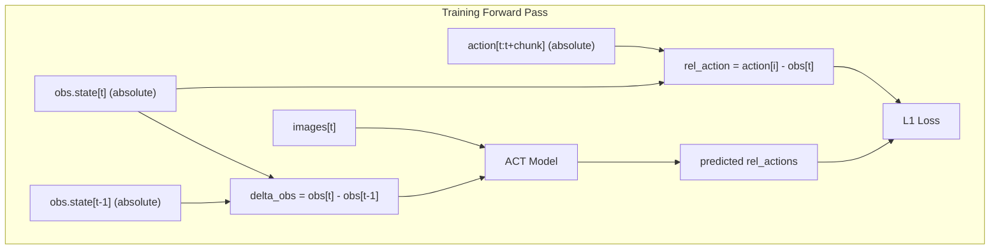
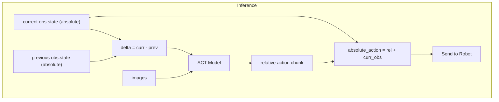

# ACT with Relative Joint Positions

## Overview

I want to train ACT with relative joint positions instead of absolute joint positions.

In the hand-guided setup the data collection embodiment might be slightly different from the inference embodiment (the former has leader motors with lower gear ratios for easier backdriving). There might be small physical and calibration differences between the embodiments. The original UMI paper suffers from the same problem, but the difference is even stronger between the UMI gripper and the arms on which they run inference. The solution they use is to:
- use relative end-effector poses as action representation (relative to the observation input that produces the action chunk output)
- use a history of two relative observations as input (relative to the first of the two observations), which captures velocity/displacement information
note that information about the absolute robot position now only comes from images and not from proprioception

I want to try to train ACT with a similar setup:
- replace absolute joint positions with relative joint positions, as action representation (relative to the observation input that produces the action chunk output) (we are using SO101 arms for both data collection and inference, so we don't have a need to replace joint positions with EE poses)
- replace the absolute joint position as input observation with the delta between the observation and the previous one (this is equivalent to feeding 2 input observations relative to the first, since the first will be the null vector)

The ProcessorStep abstraction won't work here because the same recorded action at time t would have different relative values depending on which observation produces the chunk. The transformation must happen in the model's forward pass.

## Architecture

## Implementation

### 1. Custom ACT Policy (`src/act_custom/`)

**Important:** Prefer duplicating code from `policies/act` rather than extending it. This ensures clarity, independence, and avoids potential issues with LeRobot's internal abstractions.

Create three files by duplicating and modifying LeRobot's ACT structure:

- [`configuration_act_relative.py`](src/act_custom/configuration_act_relative.py): Configuration class duplicated from `policies/act/configuration_act.py` with relative position settings
- [`modeling_act_relative.py`](src/act_custom/modeling_act_relative.py): Model duplicated from `policies/act/modeling_act.py` with relative position transformations in forward pass
- [`processor_act_relative.py`](src/act_custom/processor_act_relative.py): Processor duplicated from `policies/act/processor_act.py` (can largely reuse the same logic)

Key model changes:

- In `forward()`: Convert absolute actions to relative (`action - obs_state_t0`) before computing loss
- In `forward()`: Compute observation delta (`obs_state_t0 - obs_state_t_minus_1`)
- In `select_action()`: Convert predicted relative actions back to absolute (`pred + obs_state_t0`)
- Store previous observation for delta computation during inference

### 2. Training Script (`src/train_act_relative.py`)

Minimal training script that:

- Loads dataset with `delta_timestamps` configured to access `observation.state[t-1]`
- Uses our custom ACT policy instead of standard ACT
- Handles the relative position training loop

### 3. Inference Script (`src/eval_act_relative.py`)

Minimal inference script that:

- Loads the trained model
- Manages observation history (current and previous) for delta computation
- Converts relative predictions to absolute actions for the robot

## Dataset Requirements