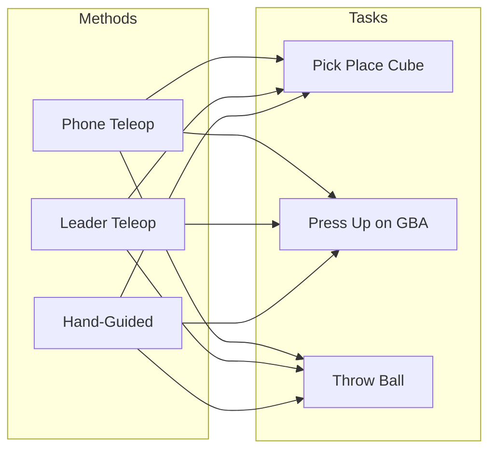

# Data Collection Methods Benchmark

## Overview

A personal benchmark experiment comparing three robot data collection methods across three manipulation tasks. The goal is to verify intuitions about the trade-offs between different teleoperation approaches. This is for a blog post, not a formal paper.---

## Data Collection Methods

### 1. Phone Teleop

- Uses phone IMU/pose to control end-effector
- **Pros**: Cheaper (only need one arm)
- **Cons**: Requires IK to map phone pose to EE pose; phone IMU often inaccurate for reliable SLAM

### 2. Leader Teleop

- Standard approach in LeRobot
- Human operates a "leader" arm that the "follower" mirrors
- **Pros**: Works directly in joint space (no IK)
- **Cons**: No force feedback; introduces lag; makes precise/reactive tasks harder

### 3. Hand-Guided Demonstration

- Custom handle + trigger setup to control follower directly
- **Pros**: Works in joint space; provides force feedback; zero lag
- **Cons**:
- Human hand occludes top/front cameras (may be constrained to wrist cam only)
- Follower motors too stiff for direct guidance, so still need leader arm hardware
- Annoying setup: must swap "leader" with "follower" when switching between data collection and inference

---

## Tasks

| Task | Description | Success Criteria ||------|-------------|------------------|| **Pick and Place Cube** | Standard manipulation benchmark | TBD || **Press Up Arrow on GBA** | Precision task; load Pokemon, press up | Character moves upward || **Throw Ping-Pong Ball into Basket** | Dynamic/reactive task requiring timing | TBD |---

## Camera Setup

- **Cameras used**: Top camera + Wrist camera (for all methods)
- **Hand-guided ablation**: Train separate models with and without top camera to measure impact of human hand occlusion

---

## Experimental Design

### Data Collection

**Warm-up demos per condition**: 10 (discarded)**Recorded demos per condition**: 50**Total conditions**: 3 methods × 3 tasks = 9**Total demonstrations collected**: 540 (90 warm-up + 450 recorded)

### Learning Effects Mitigation

**Why randomization isn't feasible**: Switching to/from hand-guided method requires physically swapping the leader and follower arms. Randomizing task/method order would mean constant hardware reconfiguration.**Mitigations**:

1. **Prior experience**: Operator already has experience with all three methods, reducing "first-time" learning effects
2. **Warm-up demos**: 10 warm-up demonstrations per condition, discarded before collecting the 50 recorded demos. This allows re-acclimation to each method/task combination.

**Acknowledged limitation**: Results may still reflect some ordering effects depending on collection sequence.

### Model Training

**Architecture**: ACT (possibly SmolVLA, but most likely ACT)| Method | Camera Config | Models per Task ||--------|---------------|-----------------|| Phone Teleop | Top + Wrist | 1 || Leader Teleop | Top + Wrist | 1 || Hand-Guided | Top + Wrist | 1 || Hand-Guided | Wrist only | 1 |**Total models**: 3 tasks × (3 + 1 ablation) = **12 models**

### Evaluation

**Episodes per model**: 20**Total evaluation episodes**: 12 models × 20 episodes = **240 episodes**---

## Metrics

### Data Collection Metrics

| Metric | Description ||--------|-------------|| **Total data collection time** | Wall-clock time to collect 50 demos || **Total dataset length** | Actual usable data (excludes mistakes/failures) || **Total mistakes** | Count of failed attempts, restarts, errors || **Qualitative impressions** | Subjective notes from the collector |

### Model Evaluation Metrics

| Metric | Description ||--------|-------------|| **Success rate** | % of 20 eval episodes that meet success criteria |---

## Hypotheses to Verify

1. **Phone teleop** is a viable cheaper alternative to leader teleop, but accuracy/reliability may suffer due to IK and IMU limitations
2. **Leader teleop** is the standard approach but lack of force feedback and inherent lag make precise or highly-reactive tasks difficult
3. **Hand-guided demonstration** provides the best control fidelity (force feedback + zero lag) but has practical drawbacks around camera occlusion and hardware setup complexity
4. **Camera ablation**: Top camera may still help hand-guided models even with human hand noise, or wrist-only may be sufficient/better

---

## Notes

- Single experimenter (you)

---

## Implementation Decisions

### Data Collection Script (`src/collect.py`)

**Memory Buffering Strategy**:

- Episodes are buffered in memory (as numpy arrays) to prevent dataset corruption on crashes
- Buffer flushes to disk every 10 episodes (configurable via `--buffer-size`)
- RAM calculation: 640×480×3 @ 30fps × 20s × 2 cameras ≈ 1 GB/episode
- 10 episodes = ~10 GB RAM

**Hand-Guided Mode**:

- Uses a single arm (physically the leader arm with trigger handle)
- Arm connected as `SO101Leader` (torque disabled for free movement)
- Same joint positions used for BOTH `observation.state` AND `action` (identical values)
- This matches standard teleop where leader→action, follower→observation, except both come from one arm

**Camera Resolution**:

- Capture at 640×480 (not native 1080p)
- Resolution set at camera connection time via OpenCV, no post-capture downscaling
- LeRobot dataset stores frames as PNG, encodes to MP4 at flush time

**Benchmark Metrics**:

- Tracked in `benchmark_metrics.csv` (persists across sessions)
- Encoding time tracked separately and subtracted from collection time
- Qualitative notes prompted at end of each session

**LeRobot Dataset Format**:

- Using v3 format with `LeRobotDataset.create()`
- Videos encoded in batches when buffer flushes
- Reference docs:
  - https://huggingface.co/docs/lerobot/en/lerobot-dataset-v3
  - https://huggingface.co/blog/lerobot-datasets-v3
