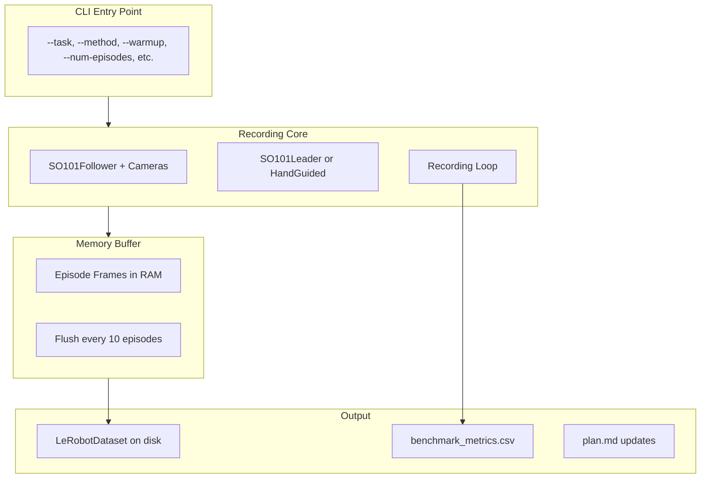

# Data Collection Script for SO-101 Benchmark

## Architecture



## Key Files

- **[src/collect.py](src/collect.py)** - Main data collection script
- **[src/benchmark_tracker.py](src/benchmark_tracker.py)** - CSV metrics tracking
- **[.cursor/rules/project-plan/plan.md](.cursor/rules/project-plan/plan.md)** - Document decisions as we go

## Implementation Details

### 1. CLI Interface

```bash
python -m src.collect \
  --task pick_place_cube \
  --method hand_guided \
  --warmup  # Optional: skips saving, just runs demos
  --num-episodes 50 \
  --buffer-size 10  # Flush to disk every N episodes
```

Supported values:

- `--task`: `pick_place_cube`, `press_gba`, `throw_ball`
- `--method`: `phone_teleop`, `leader_teleop`, `hand_guided`

### 2. Hand-Guided Mode

For hand-guided demonstrations, we use a single arm (physically the leader arm with the trigger handle):

- Connect as `SO101Leader` (torque disabled, free to move)
- Read `Present_Position` → use as **both** `observation.state` AND `action` (identical values)
- Cameras attached to this arm provide `observation.images`

This differs from standard teleop where leader → action and follower → observation.

### 3. Memory Buffering Strategy

Instead of writing to disk immediately:

1. Accumulate frames in memory (numpy arrays)
2. Every 10 episodes, flush to LeRobotDataset + encode videos
3. Track encoding time separately, subtract from total collection time

With 640×480 @ 30fps, 2 cameras, 20s max episodes: **~1 GB/episode**, 10 episodes = ~10 GB (safe with 96 GB RAM)

### 4. Benchmark Metrics CSV

Track in `benchmark_metrics.csv`:| Column | Description ||--------|-------------|| `task` | Task name || `method` | Collection method || `session_start` | ISO timestamp || `session_end` | ISO timestamp || `collection_time_s` | Wall-clock time minus encoding time || `encoding_time_s` | Time spent encoding videos || `episodes_recorded` | Number of episodes || `total_frames` | Total frames in session || `mistakes` | Re-recorded episodes count || `notes` | Qualitative impressions (prompted at end) |

### 5. Reusing LeRobot Components

Leverage existing LeRobot code:

- `LeRobotDataset.create()` and `dataset.add_frame()` for dataset writing
- `SO101Follower` / `SO101Leader` for robot/teleop
- `OpenCVCamera` for cameras
- `VideoEncodingManager` for video encoding
- `init_keyboard_listener()` for keyboard controls (exit early, re-record)
